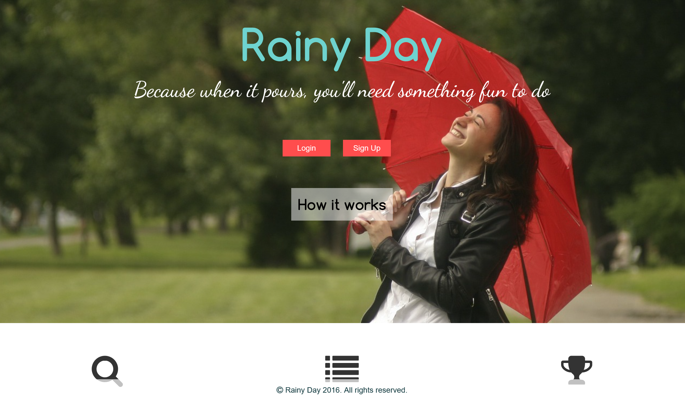
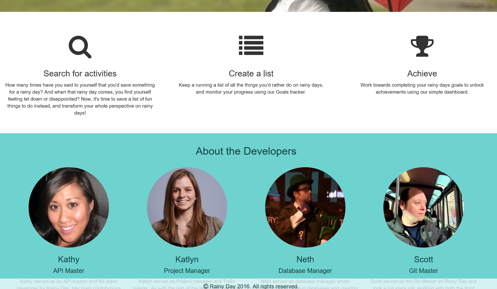
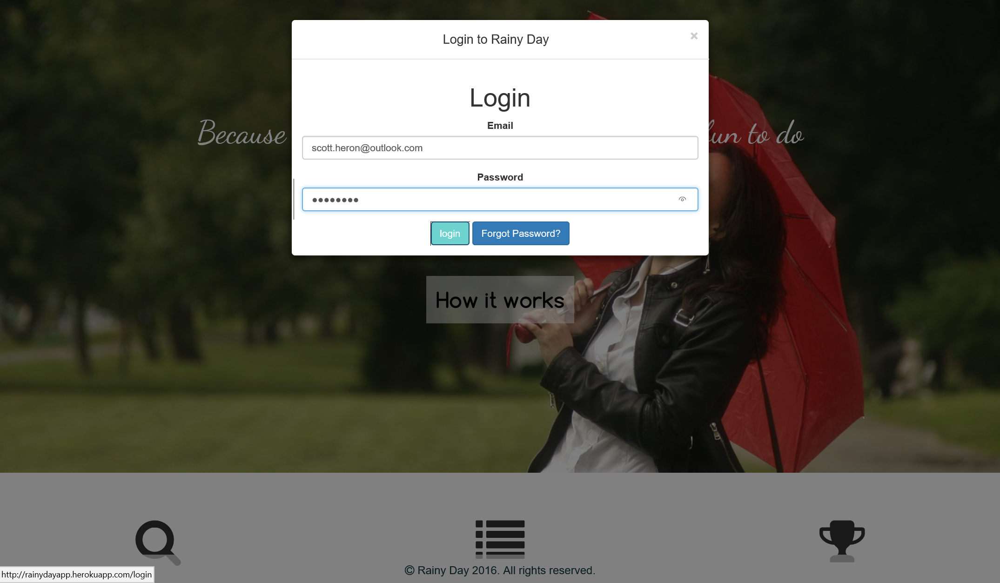
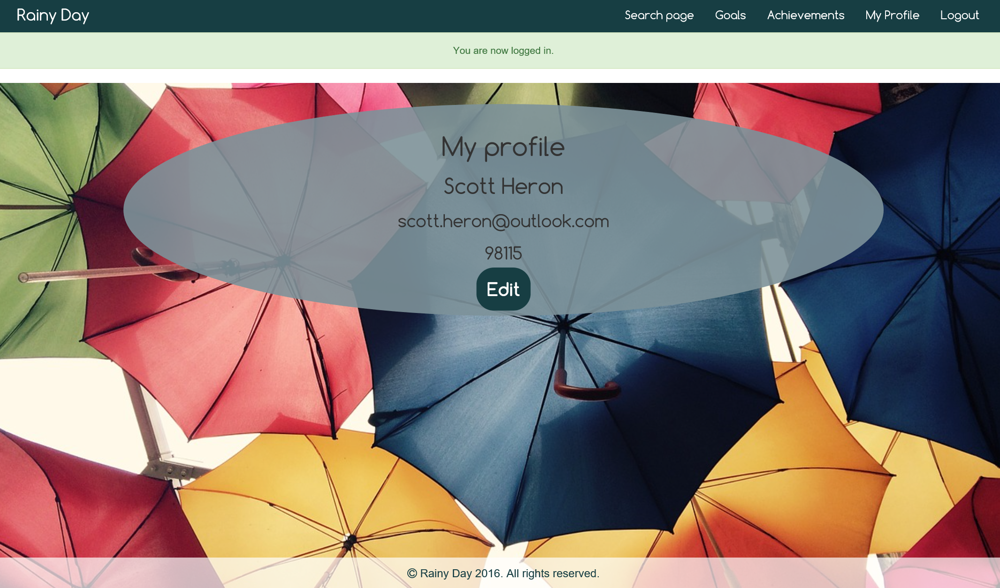

# Rainy Day
This is a web app that lets a user build a list of places they want to visit when they have free time and attach a specific goal to the location. Once the user has visited the location and accomplished the goal they can click unlock achievement and the goal will be removed and transform in to an achievement on their achievements page. 

### Screenshots

### Features
* A users can create a profile and search for places to visit.
* They can set their zip during sign up and on their profile which will be the default search location, however they can also change the zip for a one time search in a new location.
* The user can create a list to keep track of places and goals to visit and accomplish.
* The user can unlock Achievments which reflect their completed goals.
* If the user forgets their password they can request a change password reset email be sent to their address with a link to reset their password. 

### Credits
* [Ruby](https://www.ruby-lang.org/en/)
* [Rails](http://rubyonrails.org/)
* [Google Web Fonts - Questrial|Comfortaa:400](http://google.com/fonts)
* [BootStrap](https://netdna.bootstrapcdn.com)
* [Google Places](https://developers.google.com/places/)
* [Font Awesome Icons](https://fortawesome.github.io/Font-Awesome/icons/)

### Known Issues
* none

### Disclaimer
Rainy Day is an original app from [Kathy Lovan](https://github.com/katiosity), [Katlyn Buffum](https://github.com/k-buffum), Neth Horn, [Scott Heron](https://github.com/scottheron/). API data comes from Google Places (https://developers.google.com/places/)
